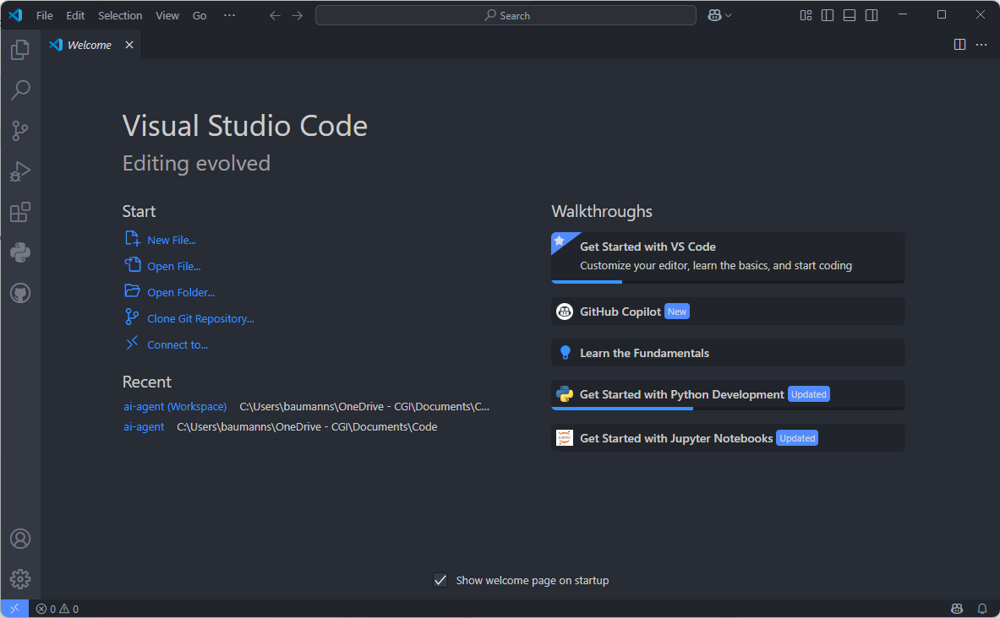
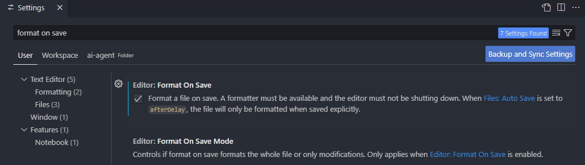

# Installation of development-environment

## Download and Installation of VSCode

- Download the VSCode-Installer from [VisualStudio.com](https://code.visualstudio.com/) and install it
- Download the Installer for Visual Studio Build Tools from [Build Tools](https://visualstudio.microsoft.com/de/downloads/#build-tools-for-visual-studio-2022) and install it
- Download Git for your client from [Git](https://git-scm.com/downloads) and install it

## Create a workspace-folder and create the project

- open a shell, change to your 'Documents'-folder and create a 'Code'-subfolder (choose your own, id you like)

    ```bash
    cd C:\Users\<username>\Documents
    ```
    ```bash
    mkdir code
    ```
    ```bash
    cd code
    ```

- clone the project from GitHub and change into the main-folder of that project

    ```bash
    git clone https://github.com/worstcasebc/ai-agent.git
    ```

    ```bash
     cd ai-agent
     ```

- Create an environment:
     ```bash
     python -m venv .venv
     ```     

## Open the project in VSCode

- Start VSCode

    

- The following screen should open 

    

- Choose 'Open Folder' to open the project folder for ai-agent

- Save the workspace as 'ai-agent.code-workspace' into the main-folder of the 'ai-agent'-project

## Customize VSCode

- Extensions can be installed by CTRL+Shift+X

- Check and (if you like) install the following extensions for VSCode

    * *Atom One Dark Theme, Better Comments, Django, GitHub Copilot, GitHub Pull Requests, IntelliCode, Jupyter, Material Icon Theme, Material Theme Icons, Path Intellisense, Python,Python Debugger, Python Environment Manager, Python Environments, Python Extension Pack, Python Intend, Pylance, Ruff, vscode-pdf* *

- Change color-theme by CTRL+K CTRL+T

- Activate 'format on save' within Settings by CTRL+,

    

- Activate 'Ruff' as 'default formatter' also in settings

- Activate 'jupyter execute selection'  

